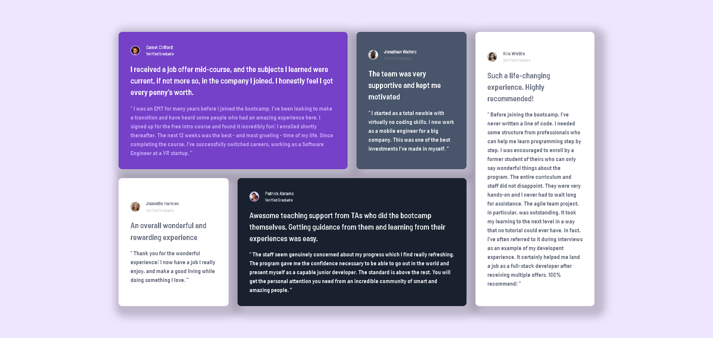
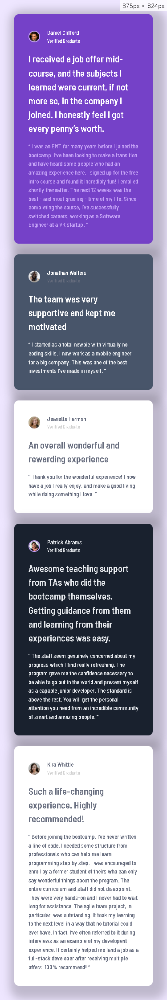

# Frontend Mentor - Testimonials Grid Section Solution

This is my solution to the [Testimonials Grid Section Challenge on Frontend Mentor](https://www.frontendmentor.io/challenges/testimonials-grid-section-Nnw6J7Un7). This project helped me practice responsive design and CSS Grid.

## Table of Contents

- [Overview](#overview)
  - [The Challenge](#the-challenge)
  - [Screenshot](#screenshot)
  - [Links](#links)
- [My Process](#my-process)
  - [Built With](#built-with)
  - [What I Learned](#what-i-learned)
  - [Continued Development](#continued-development)
  - [Useful Resources](#useful-resources)
- [Author](#author)

## Overview

### The Challenge

Users should be able to:

- View the optimal layout for the site depending on their device's screen size.

### Screenshot

### Links

- [Solution URL](https://github.com/ffozdemir/testimonials-grid-section-main)
- [Live Site URL](https://lucky-caramel-fe9c7b.netlify.app)

## My Process

### Built With

- Semantic HTML5 markup
- CSS custom properties
- CSS Grid
- Mobile-first workflow

### What I Learned

This project reinforced my understanding of CSS Grid and responsive design.

### Continued Development

I plan to focus more on accessibility and improving my workflow with CSS Grid in future projects.

### Useful Resources

- [CSS Tricks - A Complete Guide to Grid](https://css-tricks.com/snippets/css/complete-guide-grid/) - This guide helped me understand CSS Grid better.

## Author

- Frontend Mentor - [@ffozdemir](https://www.frontendmentor.io/profile/ffozdemir)
- Github - [@ffozdemir](https://github.com/ffozdemir)
